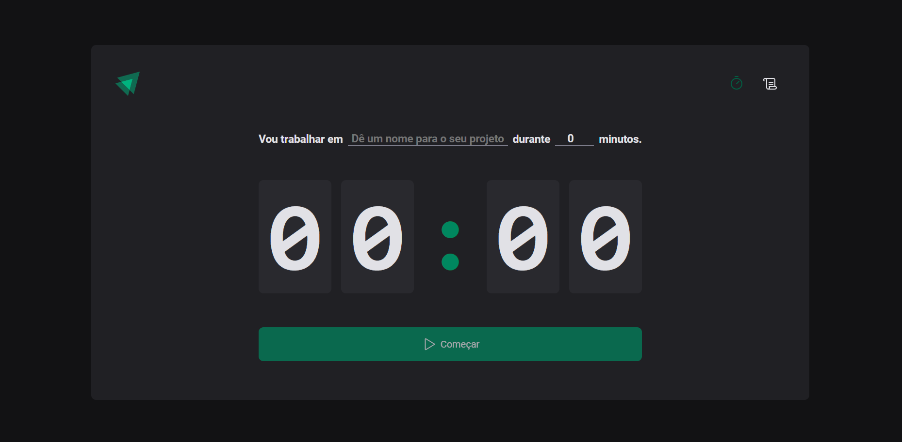
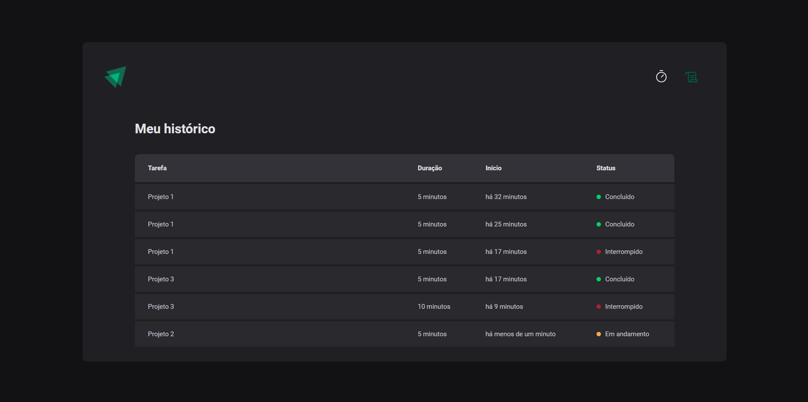

<h1 align="center">Ignite Timer</h1>

Projeto desenvolvido durante estudos sobre construções de SPAs (Single Page Application) no ReactJs com a Rocketseat utilizando diversos hooks como useState, useEffect, useReducer e useContext. Ignite Timer é uma aplicação de pomodoro onde o usuário pode criar uma atividade e colocar o tempo a ser realizado com ela. Além disso, pode acessar uma segunda página onde mostra o histórico de atividades criadas.

<br>

# Página Home: 


<br>

# Página History:


<br/>

# 🚀Tecnologias usadas

- ReactJs
- TypeScript
- Styled-components
- React-hook-form
- zod
- React-router-dom
- date-fns
- immer
- Vite
- Git e Github

<br/>

# 👉 Features

- Criar roteamento de páginas
- Estilização das páginas
- Validação de formulário com zod e useForm
- Criando Coutdown
- Reduzindo Countdown
- Interrompendo o ciclo
- Marcar o ciclo como concluído
- Guardando o estado dos ciclos no localStorage
- Formatar datas com Date-fns 


<br/>

# 👨‍💻 React-router-dom

React Router é uma biblioteca de roteamento de páginas para o React. Sua utilização na aplicação foi importante para criação de rotas entre as páginas de Home e History e também a criação de um layout único para a aplicação.

Documentação: [Docs-React-Router](https://reactrouter.com/en/main/start/tutorial)

Uso do React-Router-dom na aplicação:
````` typescript
import { Route, Routes } from 'react-router-dom'

export function Router() {
  return (
    <Routes>
      <Route path="/" element={<DefaultLayout />}>
        <Route path="/" element={<Home />} />
        <Route path="/history" element={<History />} />
      </Route>
    </Routes>
  )
}
`````

<br>

# 👨‍💻 Styled-components

Styled Components é uma biblioteca de estilização CSS-in-JS, isso quer dizer que a estilização da aplicação não é mais criada em arquivos CSS e sim em JS. A forma de aplicar ela é como se fosse componentes, como o próprio nome já diz, e lembra muito o pré-processador SASS.

Documentação: [Docs-Styled-Components](https://styled-components.com/docs/basics#getting-started)

Uso do Styled-Components na aplicação: 
```` typescript
// Arquivo DefaultLayout/styles.ts

import styled from 'styled-components'

export const LayoutContainer = styled.div`
  max-width: 74rem;
  height: calc(100vh - 10rem);
  margin: 5rem auto;
  border-radius: 8px;
  padding: 2.5rem;
  background-color: ${(props) => props.theme['gray-700']};
`

//Arquivo DefaultLayout/index.ts

 return (
    <LayoutContainer>
      <Header />
      <Outlet />
    </LayoutContainer>
  )
````

<br>

# 👨‍💻 React-hook-form

React-hook-form é uma biblioteca React onde busca utilizar da ideia controlled e uncontrolled do formulário, visando melhor desempenho e tendo o valor dos inputs em tempo real. Ela foi muito importante na aplicação para a validação juntamente com o zod e recebimento dos dados após um submit.

Documentação: [Docs-React-hook-form](https://react-hook-form.com/get-started)

Uso do React-hook-form na aplicação:
```` typescript
import { FormProvider, useForm } from 'react-hook-form'
import { zodResolver } from '@hookform/resolvers/zod'
import * as zod from 'zod'

const newCycleFormValidationSchema = zod.object({
  task: zod.string().min(1, 'É importante dizer o nome da tarefa'),
  minutesAmount: zod.number().min(5).max(60),
})

// Criando uma interface baseada no schema que criamos acima

type newCycleFormData = zod.infer<typeof newCycleFormValidationSchema>

export function Home() {
  const { interruptedCurrentCycle, createNewCycle, activeCycle } =
    useContext(CycleContext)
  const newCycleForm = useForm<newCycleFormData>({
    resolver: zodResolver(newCycleFormValidationSchema),
    defaultValues: {
      task: '',
      minutesAmount: 0,
    },
  })
  
  //Resto do código...
}

  const { handleSubmit, watch, reset } = newCycleForm
````